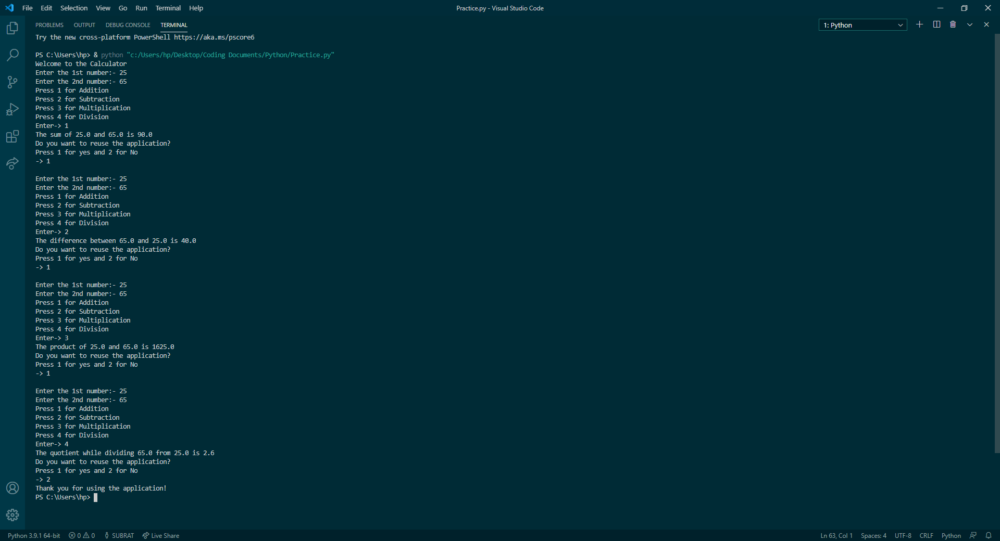

# Calculator - Codes with Explanation
The Files Section contains the .py file of the Calculator!

There is a good explanation in the codes itself.

You will notice some codes like:
```
#This is the Calculator
```
These codes (which start with hashtag) are the comments and these contains the explanation of the Codes of the Calculator!

# Screenshots of the Output
These are the Screenhots of the Project (these are in Visual Stusio Code):
</img>
These are the Output of each and every Arithmetic Operator in this Calculator 👆

# Overview
This Project is made as a Test Calculator andd the advantages of this would be as follows:

1. The users and the programmers would get a fine idea about the Arithmetic Operators in Python.
2. A Calculator would be made by the Python Beginners (or intermediates) which would boost up the confidence of the programmers.
